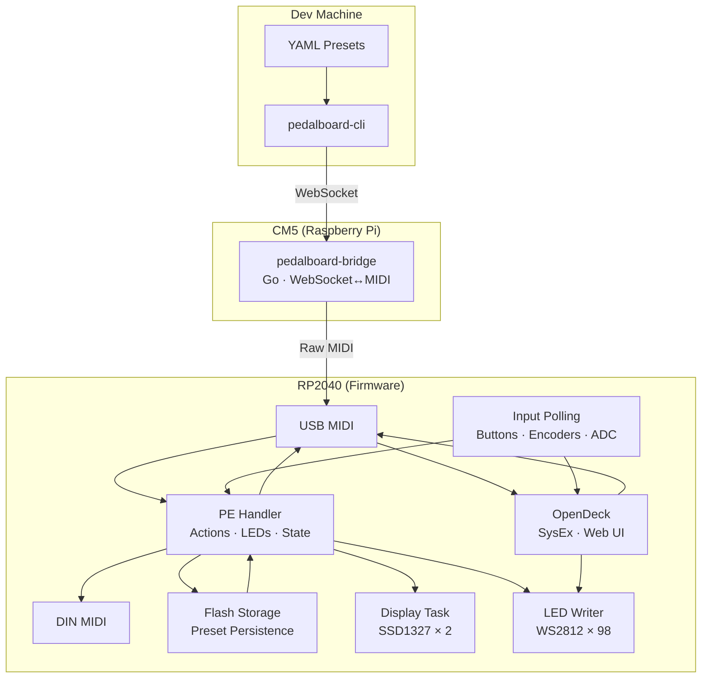
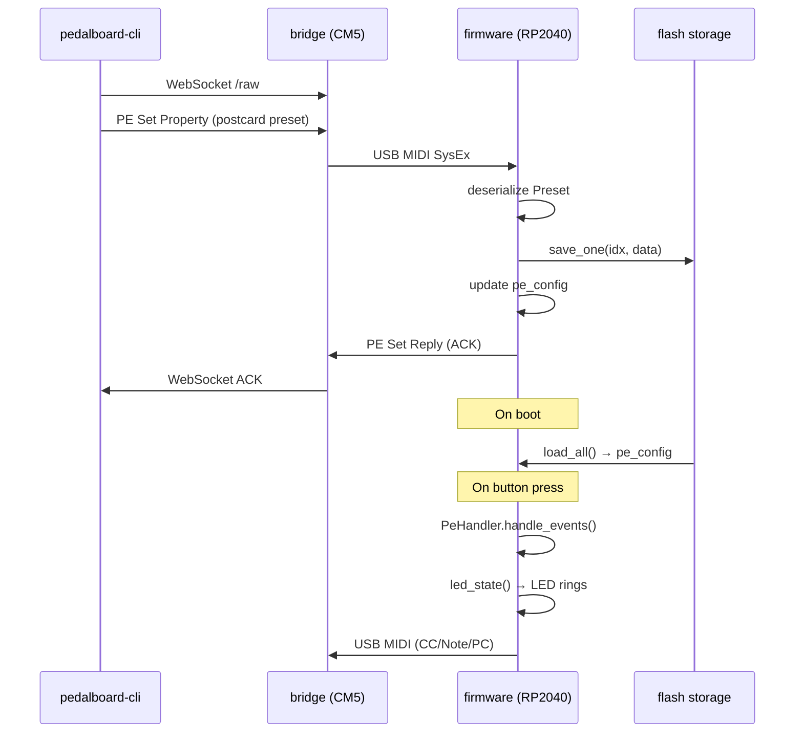
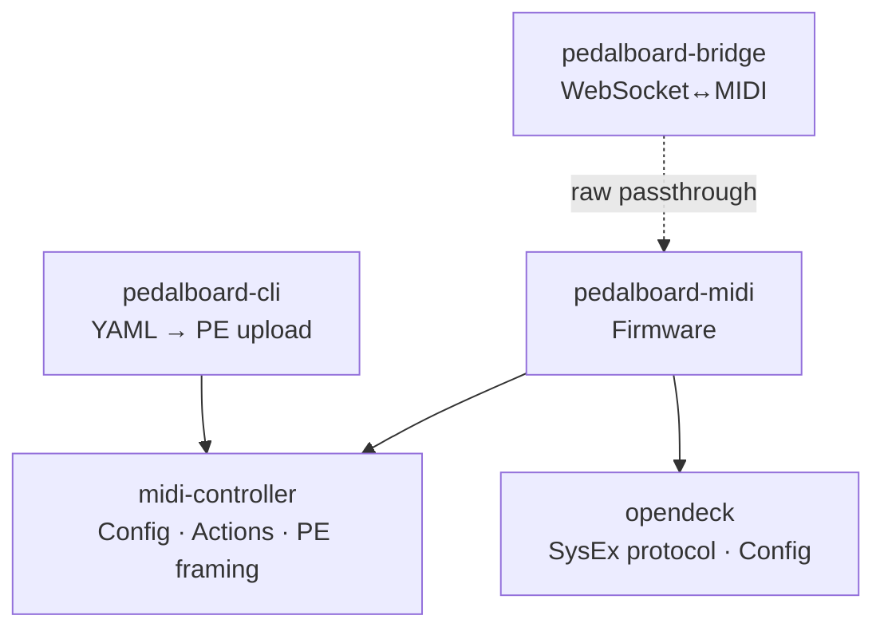

# Software Architecture

## System Overview

## Firmware Internals

> Task architecture, state machines, and storage details live in the firmware repo:
> [`pedalboard-midi/docs/architecture.md`](https://github.com/opendeckproject/pedalboard-midi/blob/main/docs/architecture.md)

## PE Data Flow

## Module Dependency

