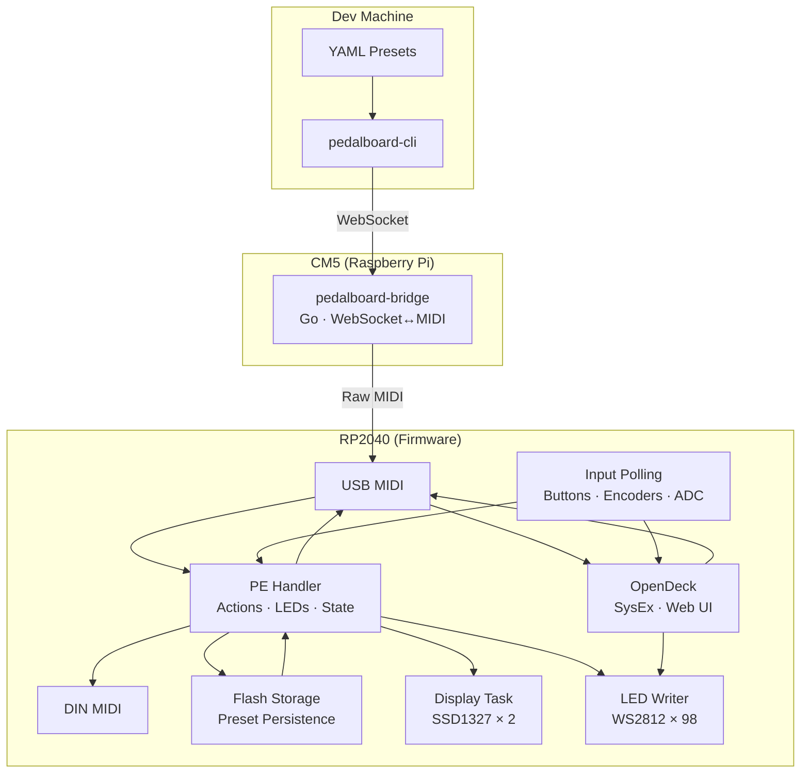
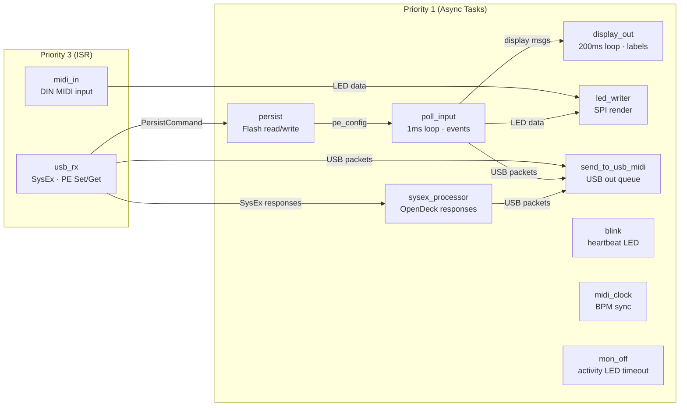
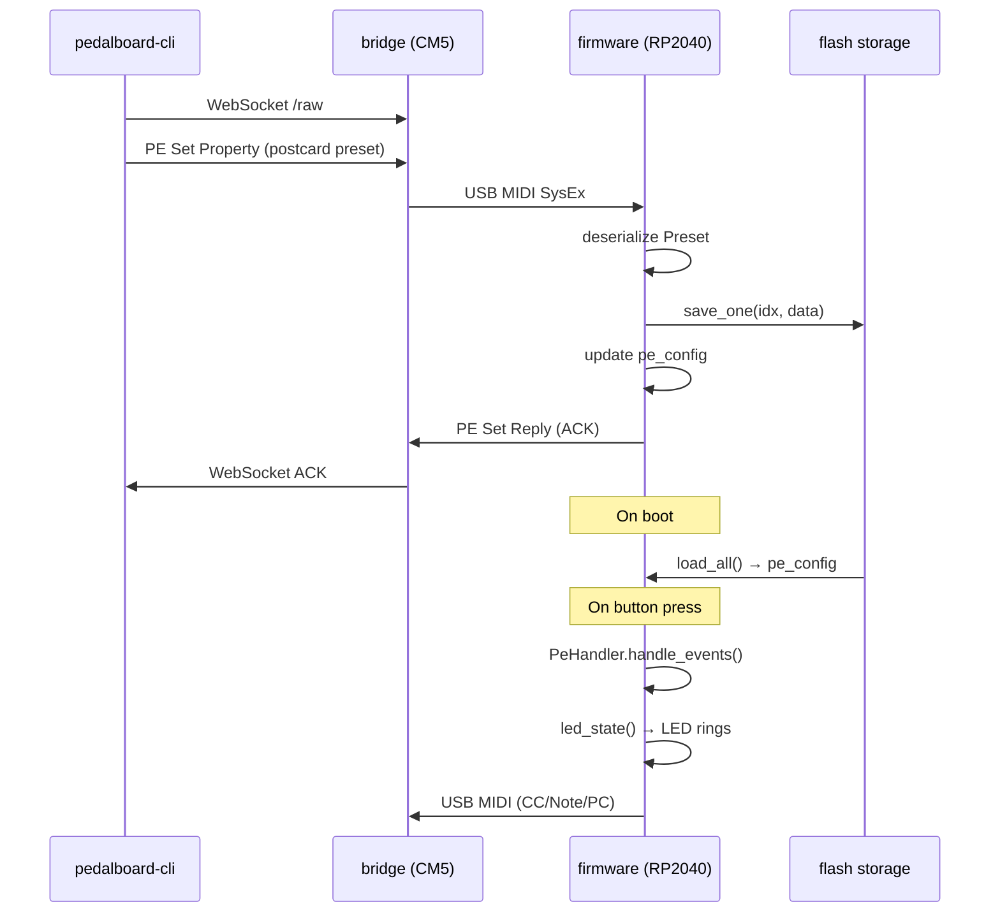
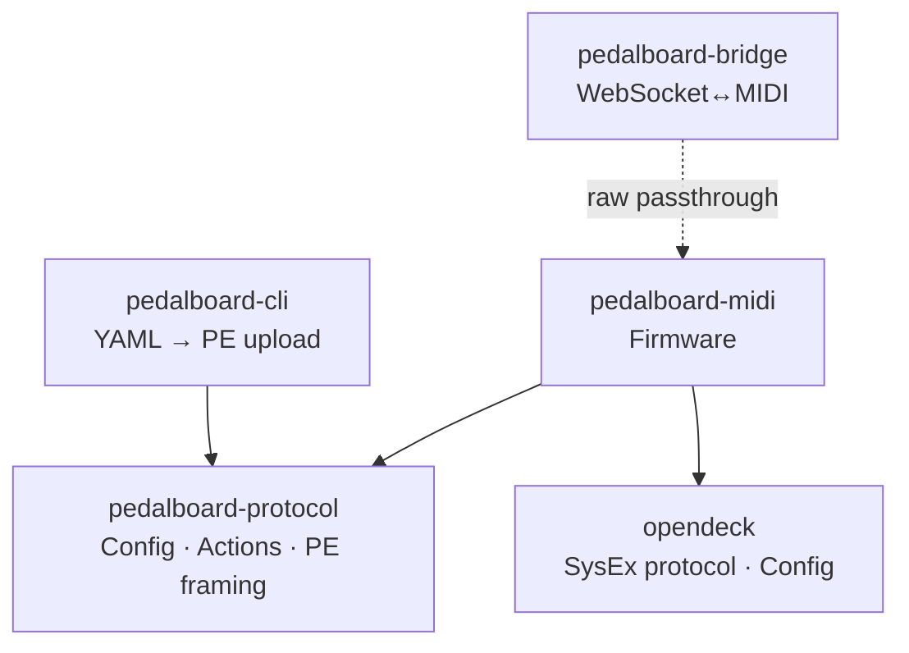
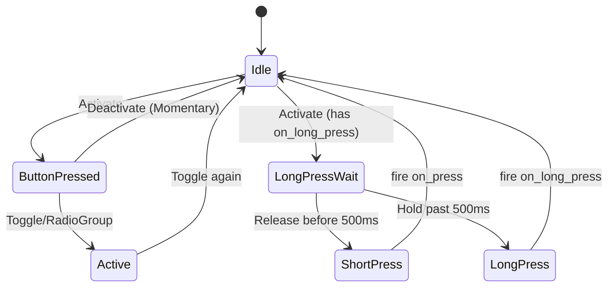

# Software Architecture

## System Overview

```mermaid
graph TB
    subgraph "Dev Machine"
        YAML[YAML Presets]
        CLI[pedalboard-cli]
        YAML --> CLI
    end

    subgraph "CM5 (Raspberry Pi)"
        BRIDGE[pedalboard-bridge<br/>Go · WebSocket↔MIDI]
    end

    subgraph "RP2040 (Firmware)"
        USB[USB MIDI]
        UART[DIN MIDI]
        PE[PE Handler<br/>Actions · LEDs · State]
        OD[OpenDeck<br/>SysEx · Web UI]
        FLASH[Flash Storage<br/>Preset Persistence]
        DISP[Display Task<br/>SSD1327 × 2]
        LEDS[LED Writer<br/>WS2812 × 98]
        INPUT[Input Polling<br/>Buttons · Encoders · ADC]
    end

    CLI -->|WebSocket| BRIDGE
    BRIDGE -->|Raw MIDI| USB
    USB --> PE
    USB --> OD
    INPUT --> PE
    INPUT --> OD
    PE --> USB
    PE --> UART
    PE --> LEDS
    PE --> DISP
    PE --> FLASH
    OD --> USB
    OD --> LEDS
    FLASH --> PE
```

## Firmware Task Architecture (RTIC)

```mermaid
graph LR
    subgraph "Priority 3 (ISR)"
        USB_RX[usb_rx<br/>SysEx · PE Set/Get]
        MIDI_IN[midi_in<br/>DIN MIDI input]
    end

    subgraph "Priority 1 (Async Tasks)"
        POLL[poll_input<br/>1ms loop · events]
        DISPLAY[display_out<br/>200ms loop · labels]
        LED[led_writer<br/>SPI render]
        SYSEX[sysex_processor<br/>OpenDeck responses]
        PERSIST[persist<br/>Flash read/write]
        SEND[send_to_usb_midi<br/>USB out queue]
        BLINK[blink<br/>heartbeat LED]
        CLOCK[midi_clock<br/>BPM sync]
        MON[mon_off<br/>activity LED timeout]
    end

    USB_RX -->|PersistCommand| PERSIST
    USB_RX -->|SysEx responses| SYSEX
    USB_RX -->|USB packets| SEND
    MIDI_IN -->|LED data| LED
    POLL -->|USB packets| SEND
    POLL -->|LED data| LED
    POLL -->|display msgs| DISPLAY
    SYSEX -->|USB packets| SEND
    PERSIST -->|pe_config| POLL
```

## PE Data Flow

```mermaid
sequenceDiagram
    participant CLI as pedalboard-cli
    participant Bridge as bridge (CM5)
    participant FW as firmware (RP2040)
    participant Flash as flash storage

    CLI->>Bridge: WebSocket /raw
    CLI->>Bridge: PE Set Property (postcard preset)
    Bridge->>FW: USB MIDI SysEx
    FW->>FW: deserialize Preset
    FW->>Flash: save_one(idx, data)
    FW->>FW: update pe_config
    FW->>Bridge: PE Set Reply (ACK)
    Bridge->>CLI: WebSocket ACK

    Note over FW: On boot
    Flash->>FW: load_all() → pe_config
    
    Note over FW: On button press
    FW->>FW: PeHandler.handle_events()
    FW->>FW: led_state() → LED rings
    FW->>Bridge: USB MIDI (CC/Note/PC)
```

## Module Dependency

```mermaid
graph TD
    PROTOCOL[pedalboard-protocol<br/>Config · Actions · PE framing]
    OPENDECK[opendeck<br/>SysEx protocol · Config]
    
    MIDI_FW[pedalboard-midi<br/>Firmware]
    CLI_APP[pedalboard-cli<br/>YAML → PE upload]
    BRIDGE_APP[pedalboard-bridge<br/>WebSocket↔MIDI]

    MIDI_FW --> PROTOCOL
    MIDI_FW --> OPENDECK
    CLI_APP --> PROTOCOL
    BRIDGE_APP -.->|raw passthrough| MIDI_FW
```

## PeHandler State Machine

```mermaid
stateDiagram-v2
    [*] --> Idle
    
    Idle --> ButtonPressed : Activate
    ButtonPressed --> Idle : Deactivate (Momentary)
    ButtonPressed --> Active : Toggle/RadioGroup
    Active --> Idle : Toggle again
    
    Idle --> LongPressWait : Activate (has on_long_press)
    LongPressWait --> ShortPress : Release before 500ms
    LongPressWait --> LongPress : Hold past 500ms
    ShortPress --> Idle : fire on_press
    LongPress --> Idle : fire on_long_press
```
