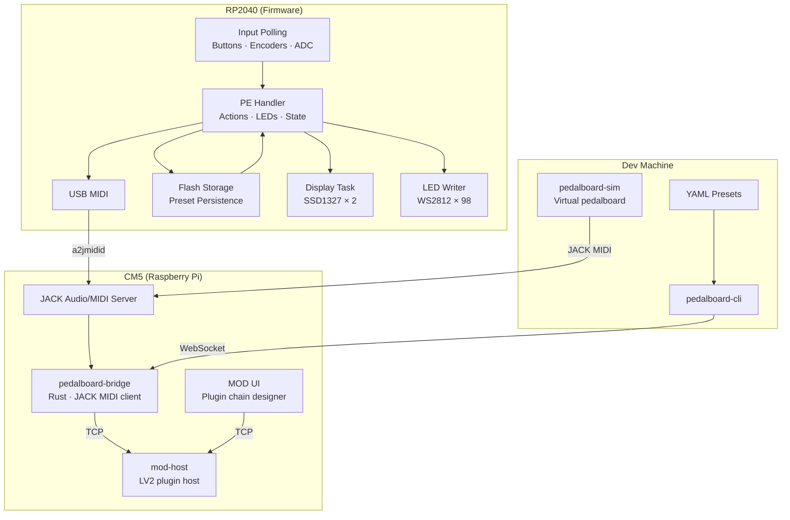
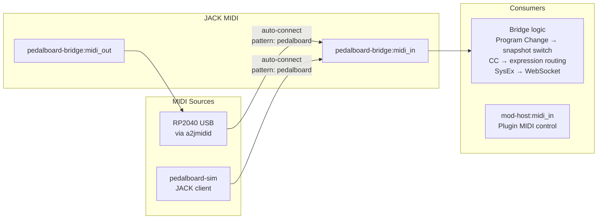
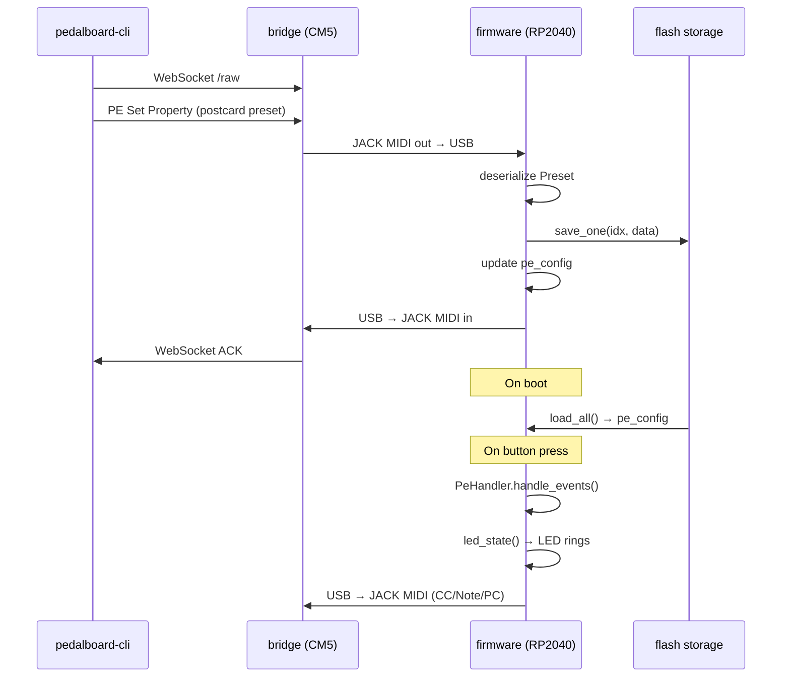
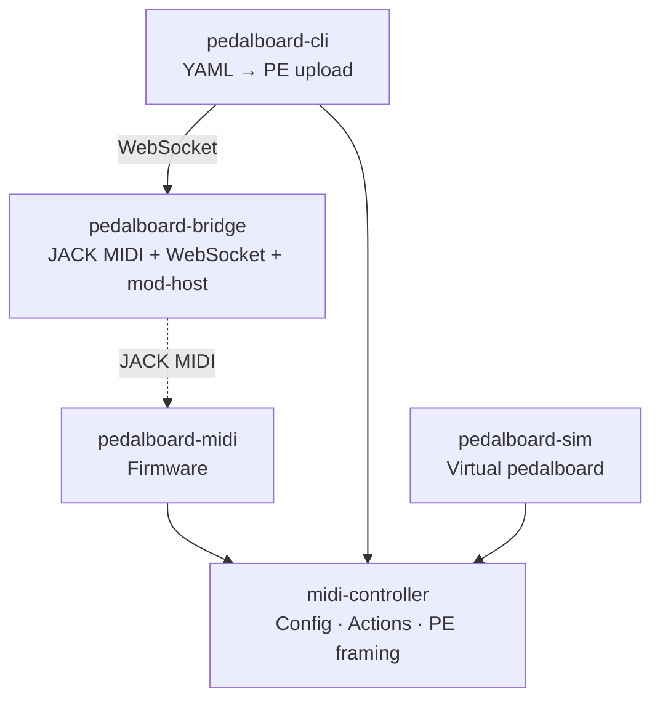

# Software Architecture

## System Overview



## MIDI Routing (JACK MIDI)

All MIDI flows through JACK — same routing graph as audio.



### Auto-connect

The bridge uses `--midi <pattern>` to auto-connect any JACK MIDI port whose alias matches the pattern (case-insensitive). Uses JACK's port registration callback for instant detection (~100ms) and reconnects after device reboot.

```bash
# On CM5:
pedalboard-bridge-rust --midi pedalboard-midi --addr 0.0.0.0:8080 --audio /etc/pedalboard/audio-rig.yaml --modhost localhost:5555
```

### CM5 setup

The RP2040 appears as a raw ALSA MIDI device (`/dev/snd/midiC*D*`). JACK exposes it as a JACK MIDI port via one of:

- **`-Xalsarawmidi`** flag on jackd (built-in, no extra daemon)
- **`a2jmidid -e`** (separate daemon, more control)

### Docker dev setup

The simulator is a native JACK MIDI client — no bridging needed. Both the simulator and bridge register as JACK clients on the same JACK server inside the container.

## Firmware Internals

> Task architecture, state machines, and storage details live in the firmware repo:
> [`pedalboard-midi/docs/architecture.md`](https://github.com/pedalboard/pedalboard-midi/blob/main/docs/architecture.md)

## PE Data Flow



## Module Dependency


