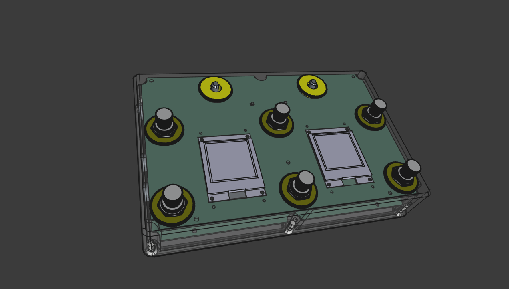
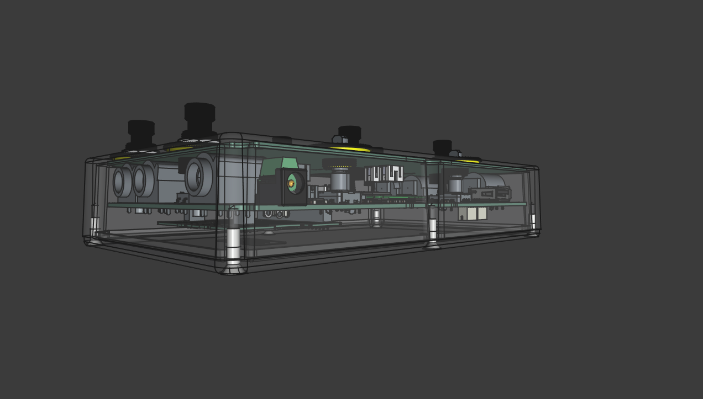

# Open Pedalboard Hardware and Software Platform

An open source MIDI foot controller and guitar processor — neural amp
modeling, effects, and looper control on a fully open platform. The
alternative to Morningstar and MOD Dwarf, built for guitarists who want
full control over their rig.

## What It Does

One board controls your entire setup: neural amp modeling, multi-effect
processing, looper control, expression pedal routing — all from a single flat
pedalboard. Define your setlist as code, and every song gets its own button
layout, amp tone, and effects chain.

**Live on stage**: step through your setlist with preset next/prev, see active
effects at a glance via color-coded LED rings, switch amp models instantly with
your feet — all with zero boot delay on the MIDI side and <3ms audio latency.

**In the studio**: spin encoders to scroll presets and tweak parameters between
takes, design your tone in the browser via MOD UI, hands-free editing without
reaching for a mouse.

## Key Features

- **6 foot buttons** — momentary, toggle, radio group, long-press, multi-action sequences with LED feedback
- **12-LED RGB rings** per button — spatial patterns (fill, dots, single) + animations (pulse, blink, rotate) synced to BPM
- **2 rotary encoders** — preset scrolling, parameter control, tap tempo
- **2 expression pedal inputs** — continuous real-time control (wah, volume, plugin parameters)
- **2 OLED displays** — button labels, encoder overlays, BPM display
- **DIN + USB MIDI** — control any MIDI gear, bidirectional
- **MIDI Clock + Tap Tempo** — sync tempo with loopers and delay pedals
- **32 presets** with per-preset defaults, state recall across power cycles
- **Neural amp modeling** — AIDA-X on CM5, 1.3ms latency, 3.4% CPU per model
- **LV2 plugin ecosystem** — hundreds of open source effects (reverb, delay, chorus, EQ)
- **MOD UI** — drag-and-drop plugin routing in the browser
- **30mm flat case** — sits under your foot, not on top of your pedalboard

## Design Goals

- Fully open source hardware and software ([CERN-OHL-P-2.0](https://ohwr.org/cernohl))
- Modular: MIDI-only controller (~€100) or combined MIDI + audio (~€200)
- Independent MIDI controller with instant startup — audio issues don't affect MIDI
- Maker friendly: common components, existing modules
- Configuration as code — YAML setlists, version-controlled, diffable
- Built for live performance and studio use
- 100% FOSS stack — no proprietary components, no vendor lock-in

## Discussion

Please join us on the [community Discord server](https://discord.gg/ncyKyryHAc).

## Architecture

The hardware architecture is modular. Two independent processors handle MIDI and audio processing, connected over USB-MIDI.

### Hardware Components

| Component                                                                | Description                                                          | Image |
|--------------------------------------------------------------------------|----------------------------------------------------------------------|-------|
| [Main Board](https://pedalboard.github.io/pedalboard-hw/latest/)        | CM5 carrier, RP-2040 MIDI controller, 6 buttons, 2 encoders         |  |
| [Display Board](https://pedalboard.github.io/pedalboard-display/latest/)| 8 RGB LED rings + 2 OLED display ports                               |  |
| [Sound Card](https://pedalboard.github.io/pedalboard-soundcard/latest/) | I²S audio codec HAT — PCM1863 ADC (106dB SNR) + PCM5242 DAC (112dB) |  |
| [RGB LED Ring](https://github.com/pedalboard/pedalboard-led-ring)       | RGB LED ring around foot button                                      | |
| [Mechanical Parts](https://github.com/pedalboard/pedalboard-case)       | CNC aluminum case and 3D printed mounting parts                      | |

### Software

| Component | Description |
|-----------|-------------|
| [MIDI Firmware](https://github.com/pedalboard/pedalboard-midi) | RP-2040 firmware (Rust/RTIC) — buttons, LEDs, encoders, MIDI, display |
| [Simulator](https://github.com/pedalboard/pedalboard-sim) | Virtual pedalboard (TUI + Web UI) — develop and test without hardware |
| [CLI](https://github.com/pedalboard/pedalboard-cli) | Configuration tool — YAML setlists → device upload |
| [Bridge](https://github.com/pedalboard/pedalboard-bridge) | WebSocket↔MIDI bridge + audio patch switching via mod-host |
| [OS](https://github.com/pedalboard/pedalboard-os) | System config — Debian + JACK + mod-host auto-start |
| [Protocol](https://github.com/pedalboard/pedalboard-protocol) | Shared config types + MIDI-CI Property Exchange framing |
| [Software Architecture](https://github.com/pedalboard/.github/blob/main/docs/software-architecture.md) | System overview, task structure, PE data flow |

### Audio Stack

| Layer | Component | License |
|-------|-----------|---------|
| Audio host | [mod-host](https://github.com/mod-audio/mod-host) | GPL |
| Amp modeling | [AIDA-X](https://github.com/AidaDSP/AIDA-X) (RTNeural) | GPL / BSD |
| Plugin UI | [MOD UI](https://github.com/mod-audio/mod-ui) | AGPL |
| Effects | LV2 plugins (Calf, x42, DPF, ...) | GPL |
| Models | [Community captures](https://tonehunt.org) | CC |
| Audio framework | JACK / PipeWire | GPL / MIT |

### Assembly

| top view                  | rear view                   |
|---------------------------|-----------------------------|
|  |  |

## Open Source Tools

- [KiCad](https://www.kicad.org) — PCB design
- [OpenSCAD](https://openscad.org/) — 3D printable parts
- [LumenPnP](https://www.opulo.io/) — PCB assembly
- [Rust](https://www.rust-lang.org/) — MIDI controller firmware
- [JACK](https://jackaudio.org/) — pro audio routing
- [mod-host](https://github.com/mod-audio/mod-host) — headless LV2 plugin host
- [AIDA-X](https://github.com/AidaDSP/AIDA-X) — neural amp modeling
